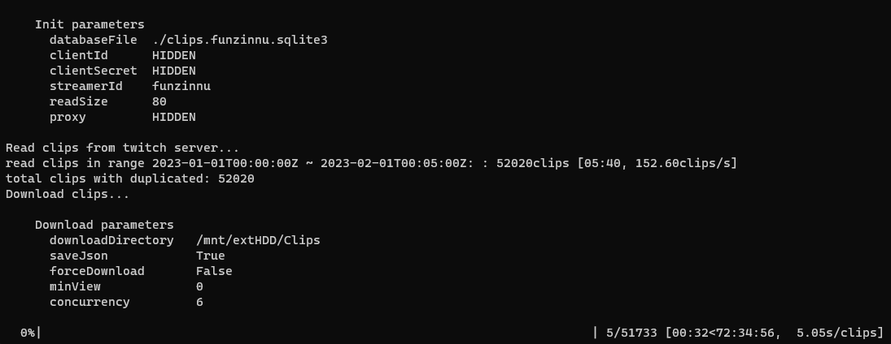

# Twitch Clip Dumper

지정한 스트리머의 모든 클립을 읽어올 수 있습니다.



## 사용법

### 의존성 설치
`python3 -m pip install -r requirements.txt`

### 설정 파일 입력 (옵션)
`config.ini` 파일에 적절한 값을 입력합니다. 아니면 실행 시 인자로 줄 수도 있고 `config.ini`의 값보다 인자 값을 우선합니다.

- `clientId` twitch api client id
- `clientSecret` twitch api client secret
- `streamerId` 스트리머 아이디 (닉네임 아님) 또는 스트리머 고유 숫자
- `readSize` api 한번 요청에 얼마나 많은 클립 수를 가져올 지 설정
- `downloadDirectory` 클립이 어디에 다운로드될 지 설정 
- `concurrency` 클립 다운로드 동시성 값
- `proxy` http 프록시 주소
- `saveJson` 클립 다운로드할 때 클립에 대한 정보를 json형식으로 저장
- `forceDownload` 이미 다운로드 된 클립이라 판단되어도 다시 다운로드


실행 시의 추가 인자 값에 대해서는 `-h`옵션을 통해서 알 수 있음.

### 실행
```bash
python3 main.py -h
```

## 예제

1. 데이터베이스 작성
```bash
python3 main.py
```

2. 데이터베이스 작성과 클립 다운로드
```bash
python3 main.py -d
```

3. 기존 데이터베이스를 사용하여 클립 다운로드만 실행
```bash
python3 main.py -n -d
```

4. 다른 데이터베이스 이름 사용
```bash
python3 main.py -b "/database/path/clips.sqlite3" 
```

기타 옵션은 `-h`를 통해서 확인할 수 있음.


## 책임과 고지
이 프로그램을 사용한다는 것은 해당 프로그램을 이용함으로 인하여 발생한 문제에 대한 책임은 개발자가 아닌 사용자 본인에게 있음을 동의한 것으로 간주함.